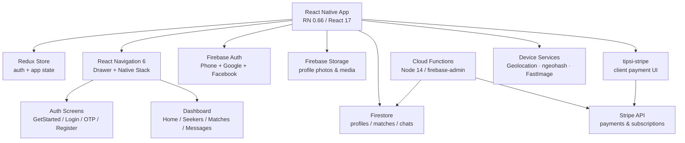

<p align="center">
  
</p>

<p align="center">
  
  
  
  
  
</p>

> **Developed by [Arslan Malik](https://github.com/arsalanmaalik461)**
> 📱 WhatsApp: [+92 300 8987448](https://wa.me/923008987448) · 🌐 Website: [arslanmalik.tech](https://arslanmalik.tech)

---

## 🌟 Executive Overview

Dating App is a cross-platform mobile dating application built with **React Native 0.66** on a **Firebase serverless backend**. The app follows the familiar swipe-based dating formula: users sign up, verify their phone number, build a profile with photos, browse nearby seekers with a deck-swiper discovery feed, match, and chat — all in one codebase that ships to both Android and iOS.

Under the hood, the project is wired for production-grade mobile concerns. Authentication supports Google Sign-In, Facebook Login, and phone-number verification with an OTP confirmation flow. Profiles and photos persist in Firebase Storage, match and chat data live in Firestore, and the `functions/` directory hosts Firebase Cloud Functions (Node.js) with Stripe wired in for payment and subscription flows. Global state is managed with Redux, navigation combines a drawer and a native stack, and Jest + ESLint cover testing and linting.

---

## 📑 Table of Contents

- [✨ Key Features & Highlights](#-key-features--highlights)
- [🖥️ Feature Showcase](#️-feature-showcase)
- [🏗️ System Architecture](#️-system-architecture)
- [🚀 Quickstart & Installation Guide](#-quickstart--installation-guide)
- [📂 Project Structure](#-project-structure)
- [🛡️ Security & Notes](#️-security--notes)

---

## ✨ Key Features & Highlights

| Feature | Description |
| :--- | :--- |
| Swipe Discovery Feed | Card-deck browsing of profiles powered by `react-native-deck-swiper` (home / seekers screens). |
| Nearby Matching | Geolocation + `ngeohash` queries so discovery is proximity-based via Firestore. |
| Phone Verification | Country picker + OTP confirmation-code screens before a profile goes live. |
| Social Login | One-tap sign-in with Google (`@react-native-community/google-signin`) and Facebook (`react-native-fbsdk`). |
| Profile Builder | Multi-step registration flow (`RegistrationStepScreen`) with photo upload (`AddPhotoScreen`) via `react-native-image-crop-picker` to Firebase Storage. |
| Matches Screen | Dedicated dashboard view for mutual matches. |
| In-App Chat | Real-time messaging built on `react-native-gifted-chat` over Firestore. |
| Payments & Subscriptions | `tipsi-stripe` client SDK plus Stripe-backed Firebase Cloud Functions for billing logic. |
| Drawer Navigation | React Navigation 6 drawer + native stack (`AppNavigator.js`) with menu, notifications, settings and profile sections. |
| State & Media Pipeline | Redux state management, `react-native-fast-image` caching, video support and `react-native-vector-icons`. |

---

## 🖥️ Feature Showcase

### 1. Onboarding & Verification

> "Verified profiles start with a verified phone."

- `GetStartedScreen` → `LoginAndRegisterScreen` → `RegistrationStepScreen` guided flow
- `VerificationScreen` with `react-native-country-picker-modal` and `react-native-confirmation-code-field` OTP entry
- Firebase Auth session state held in Redux (`src/reducers/auth.js`)

### 2. Discovery, Matching & Chat

> "Swipe through nearby seekers, match, and keep the conversation in-app."

- Swipe deck (`react-native-deck-swiper`) on the home/seekers dashboards
- `ngeohash`-backed geo queries on Firestore for proximity matching
- Matches list, gifted-chat messaging, push-ready notifications screen

---

## 🏗️ System Architecture



---

## 🚀 Quickstart & Installation Guide

### Prerequisites

- Node.js (LTS) and npm
- React Native CLI environment: Android Studio (for Android) and/or Xcode (for iOS) — see the [React Native 0.66 environment setup guide](https://reactnative.dev/docs/environment-setup)
- A Firebase project with **Authentication** (Phone, Google, Facebook), **Firestore**, and **Storage** enabled, plus `google-services.json` / `GoogleService-Info.plist` added to the native projects
- Firebase CLI (`npm i -g firebase-tools`) for the Cloud Functions in `functions/`

### Step-by-Step Installation

```bash
# 1. Clone the repository
git clone https://github.com/arsalanmaalik461/dating-app.git
cd dating-app

# 2. Install JavaScript dependencies
npm install

# 3. iOS only: install CocoaPods
cd ios && pod install && cd ..

# 4. Start the Metro bundler
npm start

# 5. Run on a device / emulator (separate terminal)
npm run android   # or: npm run ios

# 6. Cloud Functions (Stripe + admin logic)
cd functions
npm install
npm run serve     # local emulator
# firebase deploy --only functions   # deploy to Firebase
```

Run the test suite and linter with:

```bash
npm test     # Jest
npm run lint # ESLint
```

---

## 📂 Project Structure

```
dating-app/
├── App.js                  # App entry point
├── index.js                # Native registration entry
├── app.json                # App metadata
├── package.json            # RN 0.66, Firebase, Redux, Stripe deps
├── src/
│   ├── actions/            # Redux actions
│   ├── reducers/           # Redux reducers (auth, index)
│   ├── navigators/         # AppNavigator.js (drawer + native stack)
│   ├── screens/
│   │   ├── SplashScreen.js
│   │   ├── auth/           # GetStarted, LoginAndRegister, RegistrationStep,
│   │   │                   # Verification, VerifiedCode, AddPhoto, Congratulations
│   │   └── dashboard/      # home, seekers, matches, messages, notifications,
│   │                       # payment, profile, menu, settings
│   ├── components/         # Reusable UI components
│   ├── config/             # Firebase config (config.js, firestore.js)
│   ├── themes/             # Theming
│   ├── assets/             # Static assets
│   ├── json/               # Static JSON data
│   └── utils/              # Helpers
├── functions/              # Firebase Cloud Functions (Node 14, Stripe)
│   └── index.js
├── __tests__/              # Jest tests
├── android/                # Android native project
└── ios/                    # iOS native project
```

---

## 🛡️ Security & Notes

- **Never commit Firebase credentials:** `google-services.json`, `GoogleService-Info.plist`, and any `.env` keys belong in `.gitignore`, not in the repo.
- **Stripe keys:** publishable keys are safe on the client; secret keys must live only in Cloud Functions environment config — never in `App.js` or `src/`.
- **Firestore rules:** lock down profiles/chats to authenticated, rule-verified users before any production release; the default open rules from the Firebase console are not safe for a dating app's personal data.
- **Phone verification:** ensure the OTP flow enforces rate limits and code expiry server-side, not just in the UI.
- **Location privacy:** geohash queries should round or fuzz user coordinates so exact home locations are never exposed to other seekers.

---

<p align="center">
  <sub>Developed with ❤️ by <a href="https://github.com/arsalanmaalik461">Arslan Malik</a> · 📱 <a href="https://wa.me/923008987448">WhatsApp: +92 300 8987448</a> · 🌐 <a href="https://arslanmalik.tech">arslanmalik.tech</a></sub>
</p>
